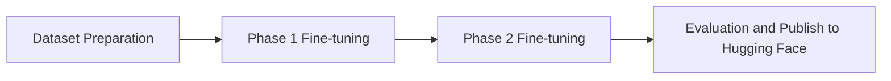

# Gemma-3-4B Function Calling Fine-tuning

This repository contains the notebooks used to fine-tune **Gemma 3 4B Instruct** for function calling using **LoRA** and **Unsloth**.

The project follows a two-stage training approach:

* Phase 1 focuses on learning the function-calling format.
* Phase 2 continues training with both function-calling and normal conversational data to reduce catastrophic forgetting.

---

# Repository Structure

```text
.
├── 01_Dataset_Preparation.ipynb
├── 02_Phase1_Finetune.ipynb
├── 03_Phase2_Finetune.ipynb
├── 04_Evaluation_and_Publish.ipynb
└── README.md
```

---

# Workflow



---

# Notebook Overview

## 1. Dataset Preparation

This project uses the **Salesforce/APIGen-MT-5k** dataset as the primary source for function-calling examples. APIGen-MT is a synthetic multi-turn agent dataset designed for training and evaluating function-calling and agentic language models. It contains 5,000 multi-turn conversations with structured tool definitions, tool calls, and assistant interactions.

Dataset: https://huggingface.co/datasets/Salesforce/APIGen-MT-5k

 *APIGen-MT: Agentic PIpeline for Multi-Turn Data Generation via Simulated Agent-Human Interplay* (Prabhakar et al., 2025)

### Dataset Preparation

Before training, the dataset is processed to match the model's expected input format:

* Apply the custom chat template.
* Tokenize all conversations.
* Filter samples exceeding the maximum sequence length.
* Generate masked labels for different training phases.
* Save the processed dataset for reproducible training.

This preprocessing is implemented in **Dataset Preparation.ipynb**.


Steps include:

* Loading the dataset
* Applying the chat template
* Tokenizing the conversations
* Filtering samples that exceed the maximum sequence length
* Saving the processed dataset

---

## 2. Phase 1 Fine-tuning

The first training stage focuses on function calling.

During this stage, only the tool-call portion of each conversation is used for computing the training loss, while the remaining tokens are masked.

---

## 3. Phase 2 Fine-tuning

This notebook continues training from the Phase 1 checkpoint.

The training data contains both normal conversations and function-calling examples. The supervision alternates between:

* Tool-call labels
* Assistant response labels

This helps retain the function-calling behavior while improving general conversational responses.

---

## 4. Evaluation and Publish

The final notebook is used to:

* Evaluate checkpoints on a custom function-calling benchmark
* Compare checkpoint performance
* Save the final LoRA adapter
* Save the tokenizer
* Upload the model to Hugging Face

---

# Evaluation

The model was evaluated on a custom function-calling benchmark covering:

* Single-tool prompts
* Normal conversational prompts
* Edge cases

## Metrics

| Metric                    |       Score |
| ------------------------- | ----------: |
| Tool Accuracy             |  **60.00%** |
| Tool Call Format Accuracy |  **60.00%** |
| JSON Validity             | **100.00%** |
| False Positive Rate       |  **40.00%** |

> **Note:** These results are from a custom evaluation benchmark created for this project and are intended as an initial assessment. Public benchmark evaluations (e.g. BFCL) have not been performed yet.

---

## 🎉 That's It — Cheers!

*  **Model Link:** **https://huggingface.co/SatyaUdayB/gemma-3-4b-FC**

Thank you for checking out my work! This is my first fine-tuning project, and I appreciate you taking the time to explore it.

If you have any suggestions, feedback, or ideas for improvement, feel free to reach out.

### Connect with Me

*  **LinkedIn:** https://linkedin.com/in/satyaudaybandaru
*  **(Twitter):** https://x.com/SatyaUdayB

### Reference

```bibtex
@article{prabhakar2025apigen,
  title={APIGen-MT: Agentic PIpeline for Multi-Turn Data Generation via Simulated Agent-Human Interplay},
  author={Prabhakar, Akshara and Liu, Zuxin and Zhu, Ming and Zhang, Jianguo and Awalgaonkar, Tulika and Wang, Shiyu and Liu, Zhiwei and Chen, Haolin and Hoang, Thai and others},
  journal={arXiv preprint arXiv:2504.03601},
  year={2025}
}
```

Thanks for visiting!
